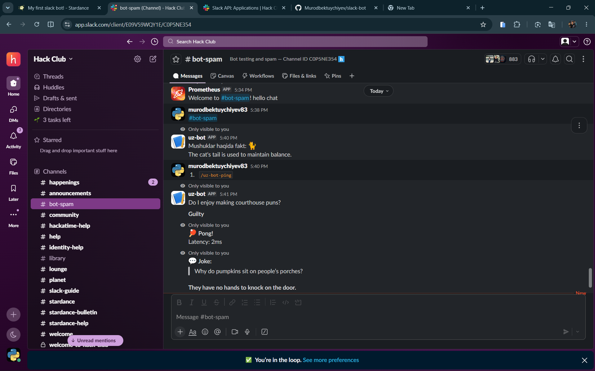

# ⚡️ uz-bot

A fun, interactive Slack bot built for Hack Clubbers to fetch instant jokes, cat facts, and check connection latency directly inside Slack.

---

## 📸 See It In Action

<!-- BU YERGA Slack'da botingiz ishlayotgan jarayondan bitta skrinshot yoki GIF havola qiling -->



---

## ⚡️ Try It Out / Quick Start

If you are in the Hack Club Slack workspace, you can trigger the bot using these commands in any channel:

- `/uz-bot-ping` - Check if the bot is alive and measure the WebSocket connection latency.
- `/uz-bot-catfact` - Get a random, educational fact about cats.
- `/uz-bot-joke` - Need a laugh? Get a quick setup/punchline joke instantly.

---

## 🛠️ How It Works (Behind the Scenes)

Instead of using standard HTTP webhooks which require exposing a public URL via tools like ngrok, I built this bot using the **Slack Bolt Framework** operating entirely over **Socket Mode**.

This means the bot establishes a secure, persistent WebSocket connection directly to Slack's servers. When you type a slash command, Slack pushes the event through this open socket, and `axios` securely fetches data from external REST APIs (like the Official Joke API and CatFact API) before formatting the response and sending it back to your chat window.

---

## ⚙️ Local Setup & Installation

Want to run your own instance of `uz-bot`? Follow these quick steps:

### 1. Clone the repository and install dependencies

```bash
git clone [https://github.com/Murodbektuychiyev/slack-bot.git](https://github.com/Murodbektuychiyev/slack-bot.git)
cd slack-bot
npm install
```
